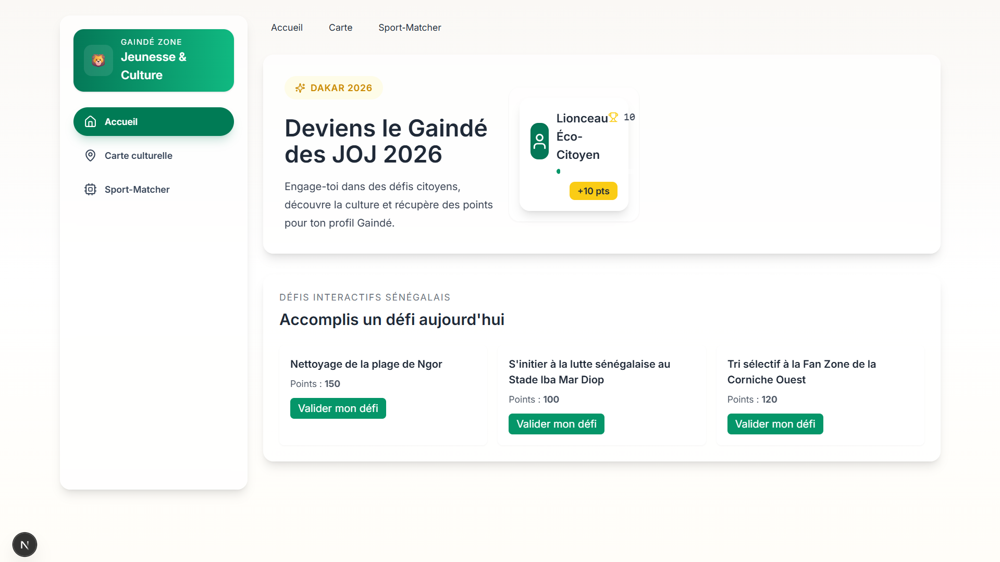
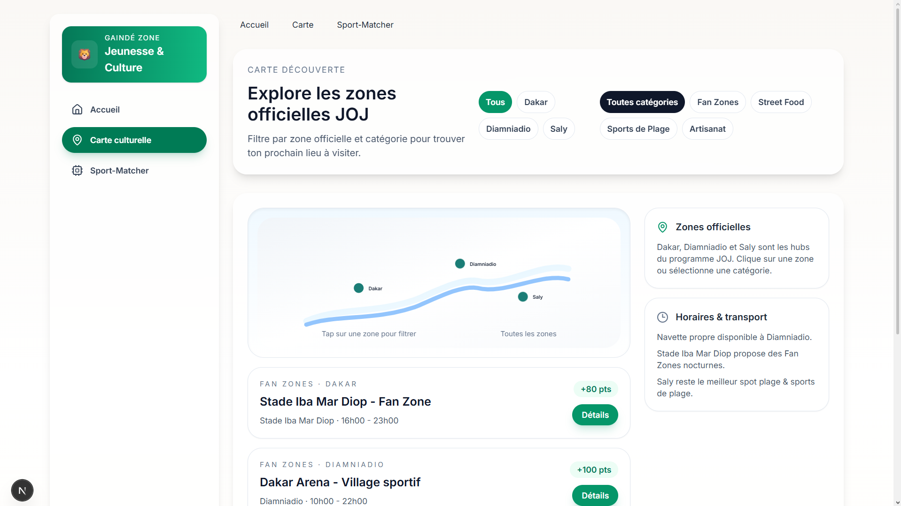
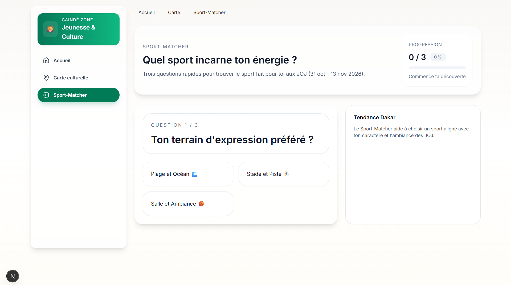

# 🦁 Gaindé Zone

> Plateforme digitale officielle des **Jeux Olympiques de la Jeunesse — Dakar 2026**  
> Engagement citoyen · Découverte culturelle · Orientation sportive

[](LICENSE)
[](https://nextjs.org/)
[](https://www.typescriptlang.org/)
[](https://nodejs.org/)
[]()


## Présentation

**Gaindé Zone** transforme la participation aux JOJ Dakar 2026 en une expérience active et responsable. La plateforme réunit trois modules complémentaires : un dashboard d'éco-citoyenneté gamifié, une carte interactive du patrimoine sénégalais, et un outil d'orientation vers les sports olympiques.

Le projet cible la jeunesse locale et valorise la culture sénégalaise à travers une interface mobile-first, conçue pour fonctionner même dans des contextes de connectivité limitée.

Ce n'est pas juste une app sur les Jeux. C'est un outil pour que la jeunesse sénégalaise s'approprie l'événement — découvrir les lieux, relever des défis écologiques, trouver son sport. Le tout dans une interface pensée pour le mobile, parce que c'est comme ça qu'on navigue ici.


## Aperçu

| Dashboard Éco-Citoyen | Carte Téranga | Sport-Matcher |  |  |  |


## Fonctionnalités

### 🌿 Dashboard Éco-Citoyen
Système de défis écologiques avec progression de profil : **Lionceau** → **Grand Gaindé** → **Super Gaindé**. Les points sont sauvegardés localement pour un usage *offline*. Chaque défi est validé via une interface caméra simulée avec retour animé.

### 🗺️ Carte Téranga Interactive
C'est la fonctionnalité dont je suis le plus fier. Une carte SVG de la côte sénégalaise avec trois zones cliquables : Dakar, Diamniadio et Saly. Filtrage par catégorie, informations sur les lieux, spécialités locales et transports propres. Transitions fluides entre les vues.

### 🏆 Sport-Matcher
Quiz de profilage en 3 étapes avec jauge de progression (33 / 66 / 100 %). L'algorithme recommande un sport des JOJ adapté au profil de l'utilisateur, avec fiche descriptive, dates de compétition et options de partage.


## Prérequis

Avant de commencer, assure-toi d'avoir installé :

- [Node.js](https://nodejs.org/) **≥ 18.0**
- [npm](https://www.npmjs.com/) **≥ 9.0** (inclus avec Node.js)
- Git


## Installation

```bash
# 1. Cloner le dépôt
git clone https://github.com/Royal-Ndr/projet-joj.git

# 2. Se déplacer dans le dossier
cd projet-joj

# 3. Installer les dépendances
npm install

# 4. Lancer le serveur de développement
npm run dev
```

Ouvre ensuite [http://localhost:3000](http://localhost:3000) dans ton navigateur.


## Variables d'environnement

Aucune variable d'environnement n'est requise pour faire tourner le projet en développement.

> À terme, les fonctionnalités de géolocalisation et la carte API dynamique nécessiteront un fichier `.env.local`.  
> Un fichier `.env.example` sera ajouté à la racine du projet pour guider la configuration.


## Structure du projet

```
projet-joj/
├── app/
│   ├── page.tsx              # Accueil — Dashboard Éco-Citoyen
│   ├── carte/
│   │   └── page.tsx          # Carte Téranga interactive
│   └── sports/
│       └── page.tsx          # Sport-Matcher
├── components/               # Composants React réutilisables
├── public/                   # Assets statiques (icônes, images)
├── docs/
│   └── screenshots/          # Captures d'écran git pour le README
├── tailwind.config.ts        # Configuration Tailwind CSS
└── next.config.ts            # Configuration Next.js
```


## Stack technique

| Technologie | Version | Rôle |
|---|---|---|
| [Next.js](https://nextjs.org/) | 15.2 | Framework React — *App Router* |
| [TypeScript](https://www.typescriptlang.org/) | 5.6 | Typage statique |
| [React](https://react.dev/) | 18 | Interface utilisateur |
| [Tailwind CSS](https://tailwindcss.com/) | 3.4 | Styles utilitaires |
| [Lucide React](https://lucide.dev/) | latest | Icônes |
```


**Choix d'architecture notables :**
- Approche *mobile-first* avec navigation basse sur mobile et barre latérale sur desktop
- Persistance locale via `localStorage` pour un mode *offline-first*
- Composants `use client` isolés pour éviter les erreurs de rendu côté serveur (SSR)


## Déploiement

Le projet n'est pas encore déployé en production. Pour le déployer toi-même sur Vercel en un clic :

[](https://vercel.com/new/clone?repository-url=https://github.com/Royal-Ndr/projet-joj)


## Roadmap

### ✅ Disponible
- [x] Dashboard de points persistants
- [x] Validation de défi par modale caméra simulée
- [x] Carte SVG interactive avec filtres
- [x] Quiz Sport-Matcher avec résultat personnalisé

### 🔜 En cours / Planifié
- [ ] Carte dynamique basée sur une API cartographique (Mapbox / Leaflet)
- [ ] Notifications géolocalisées pour défis urgents
- [ ] Passage en PWA pour un usage hors-ligne complet
- [ ] Déploiement en production sur Vercel


## Contribuer

Les contributions sont les bienvenues ! Voici comment participer :

### Workflow Git

Ce projet utilise une branche unique `main`. Toutes les contributions passent par une *pull request*.

```bash
# 1. Forker le dépôt sur GitHub

# 2. Cloner ton fork
git clone https://github.com/TON-USERNAME/projet-joj.git

# 3. Créer une branche descriptive
git checkout -b feature/nom-de-la-fonctionnalite
# ou
git checkout -b fix/description-du-bug

# 4. Vérifier que le projet compile avant de committer
npm run build
npm run lint

# 5. Committer avec un message clair
git commit -m "feat: ajouter la géolocalisation sur la carte"

# 6. Pousser et ouvrir une pull request vers main
git push origin feature/nom-de-la-fonctionnalite
```

### Conventions de commit

| Préfixe | Usage |
|---|---|
| `feat:` | Nouvelle fonctionnalité |
| `fix:` | Correction de bug |
| `docs:` | Modification de documentation |
| `style:` | Mise en forme, indentation |
| `refactor:` | Refactorisation sans ajout de fonctionnalité |
| `chore:` | Tâches de maintenance (deps, config) |

Pour signaler un bug ou proposer une idée → [ouvre une issue](https://github.com/Royal-Ndr/projet-joj/issues).


## Auteur

**Royal-Ndr** — [GitHub](https://github.com/Royal-Ndr)

Projet développé dans le cadre des Jeux Olympiques de la Jeunesse Dakar 2026. Si tu as des questions ou des idées, n'hésite pas à ouvrir une issue — je lis tout.


## Licence

Ce projet est distribué sous licence [MIT](LICENSE).